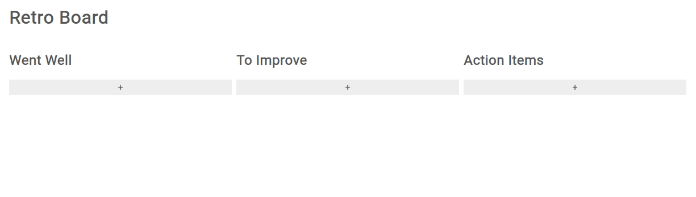

# Retrospective Board

This project is a simple retrospective board UI like those used in Scrum. It allows the user to add a card to any of three categories, and each card can have its own text, its own upvotes and downvotes, and can be moved to any another column.

The purpose of this project is to showcase proficiency in React, specifically
the use of props, the State hook and lifting state.

## Demo



## Getting Started

Follow these steps in your terminal to get this project running on your machine in development mode:

First, navigate to the directory where you would like the retro-board project to appear.

```
$cd your/preferred/directory
```

Second, clone the project from this repository to your local machine.

```
$git clone https://github.com/PatrickDCullen/retro-board.git
```

Next, navigate to the retro-board directory.

```
$cd retro-board
```

Now, install all the dependencies for the project.

```
$yarn install
```

Finally, serve the project locally.

```
$yarn start
```

## Built With

- [React](https://reactjs.org/) JavaScript library
- [yarn](https://yarnpkg.com/) package manager

## Author

Patrick Cullen
